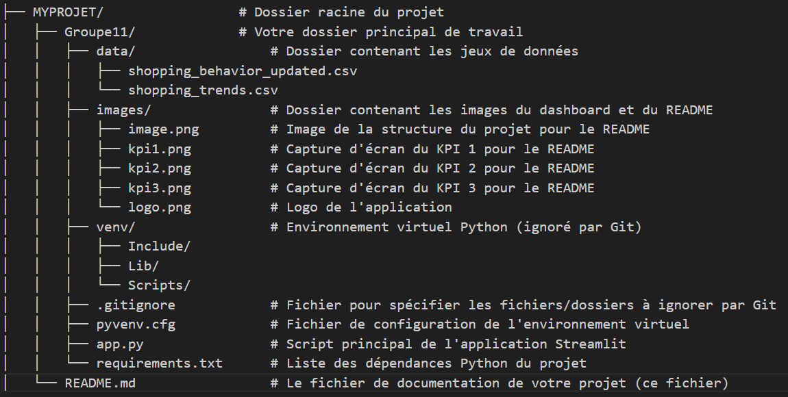
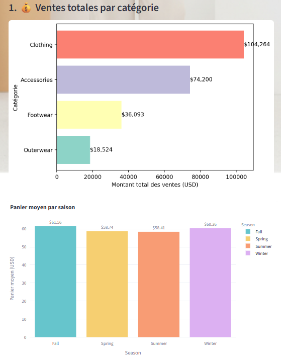
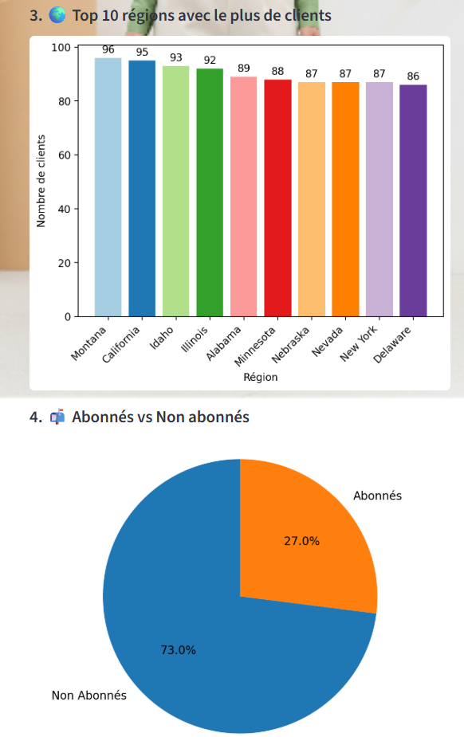

# 🛍️ Shopdern - Dashboard d'Analyse des Comportements d'Achat

## Introduction

Ce projet présente un **Dashboard interactif développé avec Streamlit** pour analyser les comportements d'achat des clients de la plateforme "Shopdern". L'objectif est de fournir des visualisations claires et des insights sur les habitudes des consommateurs, permettant une meilleure compréhension des données de ventes.

Le dashboard permet d'explorer des indicateurs clés de performance (KPIs) tels que les catégories de produits, les méthodes de paiement, les statuts d'abonnement, les évaluations clients, et bien plus encore, avec une segmentation par genre.

## Fonctionnalités Clés

* **Visualisation Interactive :** Explorez les données à travers des graphiques générés avec Plotly Express.
* **Nettoyage et Transformation de Données :** Intégration des étapes de préparation des données (renommage de colonnes, suppression de doublons) directement dans l'application.
* **Analyse par KPI :** Accès rapide à des analyses prédéfinies pour des décisions éclairées.
* **Interface Utilisateur Agréable :** Un design personnalisé avec un fond d'écran et des couleurs distinctes pour une meilleure expérience.

---

## Technologies Utilisées

* **Python 🐍 :** Langage de programmation principal.
* **Streamlit :** Framework pour la création d'applications web de données interactives.
* **DuckDB :** Base de données OLAP in-process et rapide, utilisée ici pour la lecture et le traitement des fichiers CSV directement.
* **Pandas :** Bibliothèque pour la manipulation et l'analyse de données.
* **Plotly Express :** Bibliothèque pour la création de visualisations graphiques interactives.
* **PIL (Pillow) :** Pour le traitement d'images (chargement du logo).

---

## Structure du Projet

## Aperçu du Dashboard

## Données Utilisées
Le dashboard utilise le fichier shopping_behavior_updated.csv. Ce jeu de données, provenant de Kaggle, contient des informations détaillées sur le comportement d'achat des clients, incluant des attributs clients (genre, âge, localisation), des détails sur les articles achetés (catégorie, taille), les montants des achats, les méthodes de paiement, le statut d'abonnement et la fréquence des achats.

## Analyse par KPIs
Le dashboard met en lumière plusieurs Indicateurs Clés de Performance (KPIs) :

1- Ventes totales par catégorie : Montre les revenus générés par chaque catégorie de produit.

2- Panier moyen par saison : Révèle les variations du montant moyen dépensé selon les saisons.

3- Top 10 régions avec le plus de clients : Identifie les zones géographiques avec la plus forte concentration de clients.

4- Abonnés vs Non abonnés : Compare la proportion de clients ayant un statut d'abonnement.

## Analyse Exploratoire
Des onglets dédiés permettent une exploration plus approfondie des données :

* Genre : Répartition des clients par genre et montant moyen d'achat associé.

* Catégorie : Détail des articles achetés par catégorie de produit.

* Taille & Couleur : Répartition des articles par taille.

## Auteurs
Ce projet a été réalisé par :

* Wossan

* Arnaud

* Nelly
